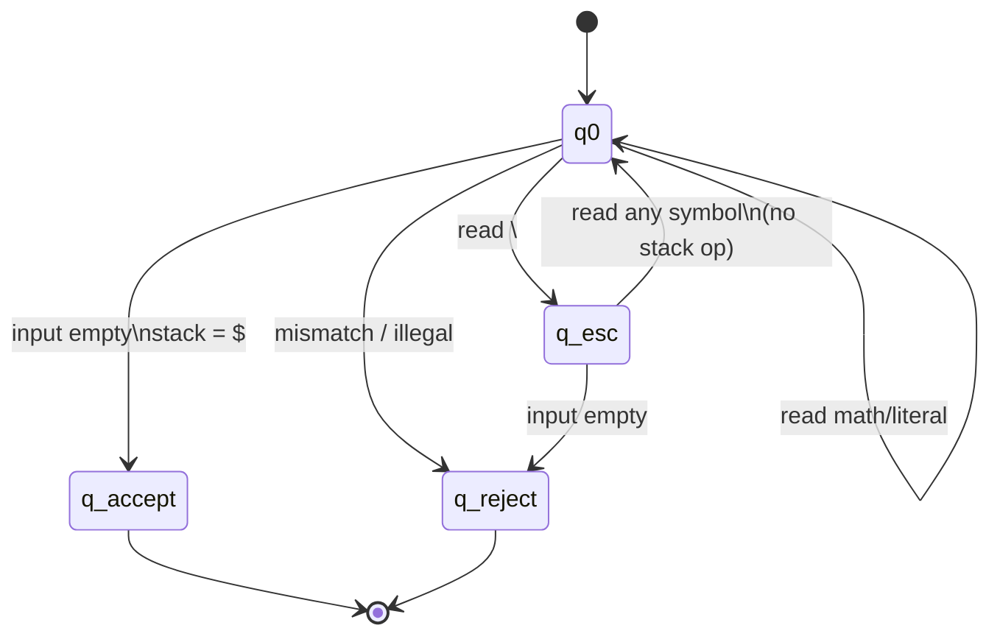

# PDA Design

## 1. Components

| Component | Definition |
|-----------|------------|
| States | `q0` (scan), `q_esc` (after `\`), `q_accept`, `q_reject` |
| Input alphabet | Σ from formal specification |
| Stack alphabet | `Γ = { $, (, [, { }` |
| Start state | `q0` |
| Start stack | `$` |
| Accept state | `q_accept` (input empty and stack = `$`) |
| Reject state | `q_reject` |

## 2. State diagram

## 3. Transition function δ

Notation: `δ(state, input, pop) → (state', push)` where `push` is a string pushed **after** popping `pop` (bottom to top). Empty push means nothing pushed after pop.

### From `q0`

| Input | Stack top | Action |
|-------|-----------|--------|
| `(` `[` `{` | any | push same symbol, stay in `q0` |
| `)` | `(` | pop `(`, stay in `q0` |
| `]` | `[` | pop `[`, stay in `q0` |
| `}` | `{` | pop `{`, stay in `q0` |
| `)` `]` `}` | wrong / `$` | → `q_reject` |
| `\` | any | → `q_esc`, no stack change |
| digit, letter, op, ws | any | consume, no stack change |
| ε (end) | `$` only | → `q_accept` |
| ε (end) | else | → `q_reject` |
| illegal char | any | → `q_reject` |

### From `q_esc`

| Input | Action |
|-------|--------|
| any symbol | consume as literal, → `q0` |
| ε (end) | → `q_reject` (dangling escape) |

## 4. Stack operations (examples)

**Input:** `{ [ ( 1 + 2 ) ] }`

| Step | Read | Stack (bottom → top) |
|------|------|----------------------|
| 0 | start | `$` |
| 1 | `{` | `$ {` |
| 2 | `[` | `$ { [` |
| 3 | `(` | `$ { [ (` |
| 4 | `1+2` | unchanged |
| 5 | `)` | `$ { [` |
| 6 | `]` | `$ {` |
| 7 | `}` | `$` |
| 8 | end | **Accept** |

**Input:** `([)]` — fails at `)` when stack top is `[` instead of `(`.

## 5. Implementation mapping

The Python class `MathNestedPDA` in `src/pda.py` implements this deterministic PDA and records a step-by-step trace for each transition, matching **Option B** from the course project guide.
